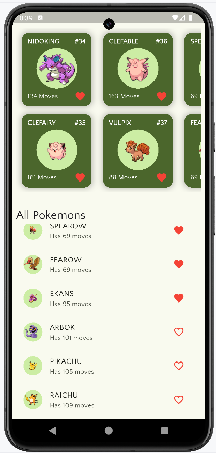
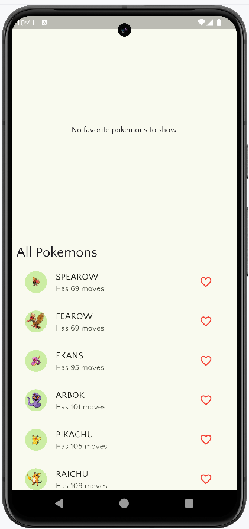
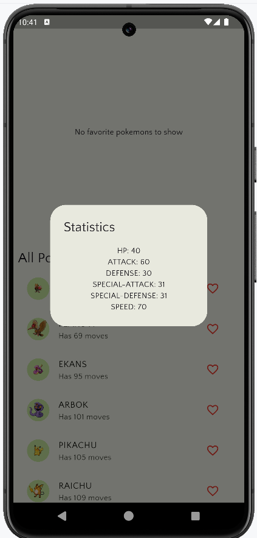

# 🧩 Pokedex Flutter App

A simple and visually appealing **Pokedex** mobile application built using **Flutter** and **Riverpod** state management. This project was developed for learning purposes by following an excellent tutorial by [Johannes Milke](https://www.youtube.com/@JohannesMilke), available on YouTube.

📺 **Tutorial Video**: [Build a Pokedex App with Flutter](https://www.youtube.com/watch?v=vBhQx2qDtGQ)

---

## 📱 Screenshots

<table>
  <tr>
    <td align="center">
      <b>Home Screen (With Favorites)</b><br>
      
    </td>
    <td align="center">
      <b>Home Screen (Without Favorites)</b><br>
      
    </td>
    <td align="center">
      <b>Stats Dialog</b><br>
      
    </td>
  </tr>
</table>

---

## 🚀 Features

- ✅ Clean and modern UI using Flutter widgets  
- ✅ State management using `flutter_riverpod`  
- ✅ Asynchronous API calls to fetch Pokémon data  
- ✅ Infinite scrolling and dynamic list rendering  
- ✅ Detail screen for each Pokémon  
- ✅ Optimized scroll performance and image loading

---

## 🛠️ Technologies Used

- **Flutter**
- **Dart**
- **Riverpod**
- **HTTP Package**
- **REST API** ([PokeAPI](https://pokeapi.co/))
- **Material Design Components**

---

## 📚 What I Learned

- How to manage state efficiently using **Riverpod**
- Building responsive UI with **Flutter widgets**
- Handling **asynchronous HTTP requests**
- Creating **scrollable lists** with infinite loading
- Structuring Flutter apps using best practices

---

## ▶️ Getting Started

To run this app locally, follow these steps:

### Prerequisites

- Flutter SDK installed: [Flutter Installation Guide](https://docs.flutter.dev/get-started/install)
- Android Studio or VS Code

### Installation

```bash
# Clone the repository
git clone https://github.com/rasel-093/pokedex
cd pokedex

# Install dependencies
flutter pub get

# Run the app
flutter run
